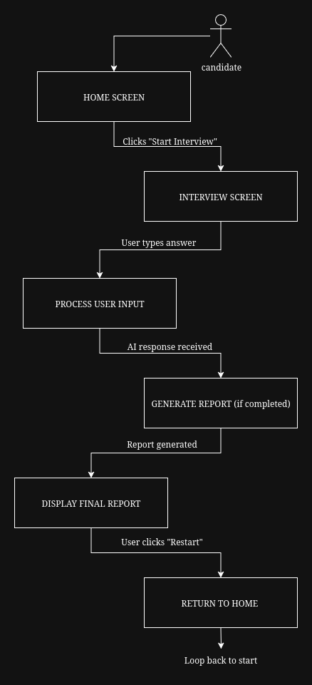

# Ninja-Interviewer
AI-Powered Excel Mock Interviewer

## Problem: 
Manual Excel interviews are slow, inconsistent, and scale poorly during rapid hiring.
## Solution: 
An AI-powered Excel Mock Interviewer that conducts structured, adaptive, evaluative interviews via natural conversation — assessing real Excel skills without human intervention.

## Tech Stack
Frontend - Streamlit
Backend Logic - Pure Python
LLM Engine - OpenRouter.ai
Deployment - Streamlit Cloud

## Live Link : https://ninjainterview.streamlit.app/

## How to Run Locally

1. Clone the repo

```bash
it clone https://github.com/yourusername/Ninja-Interviewer.git
cd Ninja-Interviewer
```

2. Create .env file
```bash
touch .env 
```
&emsp;add your open router key here: \
&emsp; &emsp; [get openrouterapi key here](https://openrouter.ai/settings/keys)

3. Install dependencies
```bash
pip install -r requirements.txt
```

4. Run the app
```bash
streamlit run ui/app.py
```

5. Open browser → http://localhost:8501 

## Flowdiagram


## References:
[Building effective agents - by Anthropic](https://www.anthropic.com/engineering/building-effective-agents)